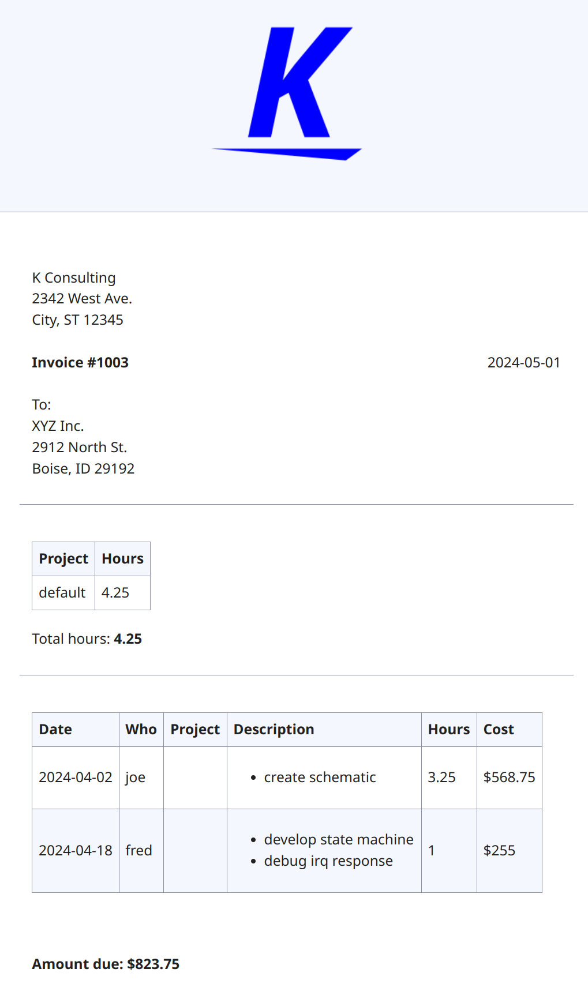

Kairos is a tool that generates beautiful invoices from time log files stored in
Git. This makes it easy for your team to log their time using their standard
tools (Git/Text Editor) and then generate HTML invoices using a simple template.
Advanced reports can be genberated using [hledger](https://hledger.org/).

I wrote this tool after looking at many other options and concluding there has
to be a better way. Having recently switched to hledger command line accounting,
this seemed like a logical step. It is simple, fast to run, and easy to customize.

## Features

- time is logged in [timedot](https://hledger.org/dev/hledger.html#timedot)
  format (easy and convenient for developers)
- supports multiple projects/activities (you can track at any granularity your
  activities)
- multi-user support with different rates for different users
- time log files stored in Git are easily audited
- full power of hledger for generating reports and integration with your
  accounting system.

## Example

See the [example](example/) for information on how to use this tool.

Example invoice:

## Requirements

- parse billing table for combination of user/account
  - match the most specific entry
  - rates can have part of an account. For example, a rate for `cust:a` would
    match time entries for `cust:a:proj1`
- parse all timedot files in dir and build collection of entries and add amounts
- generate an invoice for a particular month
- generate ledger entries
- weekly status reports
