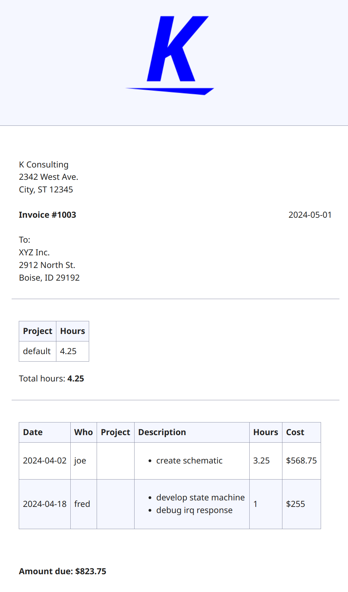

# Kairos Example

To run this example (in a Linux/MacOS shell):

[`./run-example.sh`](run-example.sh)

This will generate two invoices:

- [AB Corp](https://kairosdotapp.github.io/kairos/example/2024-04_time-cust-abcorp.html)
- [XYZ Inc.](https://kairosdotapp.github.io/kairos/example/2024-04_time-cust-xyzinc.html)

These can be printed or copy/pasted into an email.

## Required files

The following files are required:

- [`rates.csv`](rates.csv): defines rates for customers/projects/tasks/users.
  The longest match with the timelog entires is used.
- [`customers.csv`](customers.csv): customer information
- An invoice template ([example](../invoice.tpl)): Template that defines how the
  invoice looks. This can be modifiy to include/remove columns, change logo,
  etc.
- timelog files ([fred](fred.timedot), [joe](joe.timedot)): time log files in
  [timedot](https://hledger.org/dev/hledger.html#timedot) format.

## Generating reports

hledger is capable of generating many types of reports from timedot files. One
example is weekly totals:

`hledger -f ledger.journal bal --weekly --tree`

This generates:

```
             || 2024-04-01W14  2024-04-08W15  2024-04-15W16
=============++=============================================
 time:cust   ||         15.50              0           1.00
   abcorp    ||         12.25              0              0
     dev     ||          5.25              0              0
     nc      ||          2.75              0              0
     support ||          2.25              0              0
     travel  ||          2.00              0              0
   xyzinc    ||          3.25              0           1.00
-------------++---------------------------------------------
             ||         15.50              0           1.00
```

## Example invoice


